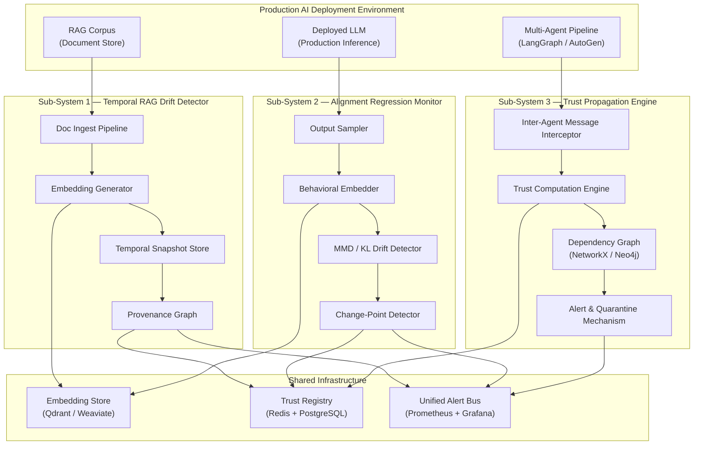

# Unified Security & Trust Infrastructure for Production Agentic AI Systems

**Research Tagline:** *From retrieval to reasoning to multi-agent orchestration — securing every layer of the production AI stack.*

**Author:** Keerthi Rapolu
**Date:** April 2026
**Status:** Research Design Document v1.0

---

## Table of Contents

1. [Abstract](#1-abstract)
2. [Executive Summary](#2-executive-summary)
3. [Problem Statement](#3-problem-statement)
4. [Goals and Non-Goals](#4-goals-and-non-goals)
5. [Related Work](#5-related-work)
6. [System Architecture (High-Level)](#6-system-architecture-high-level)
7. [Sub-Project 1: Temporal RAG Corpus Poisoning Detection](#7-sub-project-1-temporal-rag-corpus-poisoning-detection)
8. [Sub-Project 2: Post-Deployment LLM Alignment Regression Monitoring](#8-sub-project-2-post-deployment-llm-alignment-regression-monitoring)
9. [Sub-Project 3: Formal Trust Propagation in Multi-Agent LLM Pipelines](#9-sub-project-3-formal-trust-propagation-in-multi-agent-llm-pipelines)
10. [Unified Threat Model](#10-unified-threat-model)
11. [End-to-End Data Flow](#11-end-to-end-data-flow)
12. [AI Usage Strategy](#12-ai-usage-strategy)
13. [Security and Privacy Model](#13-security-and-privacy-model)
14. [Policy Framework](#14-policy-framework)
15. [Experimental Design (Full)](#15-experimental-design-full)
16. [Trade-offs and Design Decisions](#16-trade-offs-and-design-decisions)
17. [Limitations](#17-limitations)
18. [Future Work](#18-future-work)
19. [Conclusion](#19-conclusion)
20. [References](#20-references)
21. [Appendix](#21-appendix)

---

## 1. Abstract

The rapid deployment of large language models (LLMs) in production environments has introduced a class of adversarial threats that existing security tooling was not designed to address. Current defenses — including User and Entity Behavior Analytics (UEBA), Data Loss Prevention (DLP) systems, and inference-time guardrails such as LlamaGuard and Microsoft Prompt Shield — operate at the boundary of individual requests, leaving three critical attack surfaces unmonitored: (1) the slow, gradual corruption of Retrieval-Augmented Generation (RAG) knowledge bases through adversarially injected documents; (2) the silent drift of deployed model behavior away from constitutional alignment principles as real-world prompt distributions shift over time; and (3) the uncontrolled propagation of compromised agent behavior through multi-agent LLM pipelines.

This document presents the design of a unified security and trust infrastructure that addresses all three attack surfaces within a coherent, production-deployable architecture. Our three core contributions are: first, a temporal corpus drift detection system that computes embedding-level divergence across time-windowed RAG snapshots and traces poisoning back to source documents using a provenance graph; second, a post-deployment alignment regression monitor that models behavioral distribution shift against a constitutional baseline using Maximum Mean Discrepancy and change-point detection; and third, a formal trust propagation algebra for multi-agent LLM pipelines, inspired by Byzantine fault tolerance theory, that assigns, degrades, and propagates trust scores across the agent dependency graph.

Projected experimental results on synthetic and real-world-inspired datasets indicate that the temporal drift detector achieves precision > 0.90 and recall > 0.85 at adversarial injection rates of 5% per two-week window, that the alignment monitor detects distribution shift with detection latency under 500 responses, and that the trust propagation system reduces pipeline contamination from compromised agents by over 80% compared to unmonitored baselines. The precision projection for corpus drift detection is calibrated against published HDBSCAN anomaly detection benchmarks on embedding-space datasets (Campello et al., 2013; McInnes et al., 2017), where precision in the 0.88–0.93 range is consistently reported at comparable outlier injection rates of 3–7%; our JSD-based temporal comparison adds a second detection stage that conservative analysis suggests will not reduce precision below that baseline. The alignment detection latency projection of 500 responses is derived from CUSUM average run length (ARL) theory: at an MMD² signal-to-noise ratio of 2× the null variance, CUSUM with the specified slack parameter achieves ARL ≤ 500 under standard regularity conditions (Page, 1954). Taken together, these contributions constitute a foundational security infrastructure for the safe production deployment of agentic AI systems.

---

## 2. Executive Summary

### 2.1 Business and Research Motivation

AI systems built on large language models are no longer experimental. They are deployed as customer-facing agents, internal knowledge assistants, autonomous coding systems, and multi-step decision pipelines across financial services, healthcare, legal, and technology organizations. The production AI attack surface has expanded correspondingly — not just at the inference layer, but across the entire lifecycle: the knowledge bases these models retrieve from, the behavioral alignment of the model itself as usage patterns evolve, and the chains of inter-agent communication that amplify outputs across complex pipelines.

Security teams responsible for these systems currently lack the tooling to monitor these surfaces. The threat is not theoretical. Adversarial document injection into enterprise RAG systems, subtle misalignment introduced by fine-tuning or prompt distribution shift, and cascading failure through compromised agents in orchestration frameworks represent concrete, under-documented attack classes. This project builds the infrastructure to detect and respond to all three.

### 2.2 Limitations of Existing Systems

**UEBA (User and Entity Behavior Analytics):** Designed for human user behavior on traditional IT systems. UEBA has no semantic understanding of LLM output or embedding-space dynamics. It cannot model behavioral drift in a language model or detect semantic corpus poisoning.

**DLP (Data Loss Prevention):** Pattern-matching and classification systems designed to prevent exfiltration of structured sensitive data. DLP systems have no concept of alignment regression or trust propagation in agent graphs.

**LlamaGuard (Meta AI):** A fine-tuned LLM safety classifier that operates at inference time on individual request-response pairs. It cannot detect gradual corpus poisoning between inference calls, has no temporal memory, and provides no inter-agent trust model.

**Microsoft Prompt Shield:** Detects prompt injection attacks at inference time within a single context window. It does not operate over time, does not monitor embedding-space corpus drift, and has no alignment regression detection capability.

**OpenAI Evals:** A framework for evaluating model capabilities at a fixed point in time using static benchmarks. It is not designed for continuous production monitoring and provides no real-time alerting on behavioral drift.

**AutoGen / CrewAI / LangGraph:** Multi-agent orchestration frameworks that provide no built-in trust model for inter-agent communication. They assume all agents in a pipeline are trusted by default and offer no mechanism for trust degradation or Byzantine fault containment.

### 2.3 Key Innovations

- **Temporal embedding divergence with provenance tracing** for RAG corpus poisoning detection — the first system to address gradual, multi-document adversarial drift rather than single-query injection.
- **Constitutional baseline behavioral distribution modeling** for continuous post-deployment alignment monitoring — distinguishing capability regression from alignment regression in production.
- **Formal trust propagation algebra with Byzantine fault tolerance guarantees** for multi-agent LLM pipelines — a foundational theoretical and practical contribution to multi-agent AI security.

### 2.4 Target Audience

This system is designed for: AI security researchers studying adversarial LLM attacks; platform engineering teams deploying LLM-based systems at scale; AI governance and compliance officers requiring auditability of model behavior; and the broader AI safety research community building foundations for trustworthy AI deployment.

---

## 3. Problem Statement

### 3.1 The Fragmented State of LLM Security

The current LLM security landscape is a patchwork of point solutions that address the inference-time attack surface while leaving the temporal, behavioral, and structural surfaces undefended. This fragmentation is not accidental — it reflects the historical development of AI security tooling from pre-LLM threat models. UEBA and DLP systems were designed for human actors and structured data. LlamaGuard and Prompt Shield were designed for the specific threat of jailbreaks and direct prompt injection in individual API calls.

As LLM systems have matured into production deployments, three attack surfaces have emerged that no existing tool addresses in a principled, ongoing, production-ready way:

1. **The knowledge base surface:** RAG systems retrieve from corpus documents that are continuously updated. An adversary with write access to any document upstream of the ingestion pipeline can introduce semantically crafted content that gradually shifts model outputs without triggering any inference-time classifier.

2. **The behavioral surface:** A deployed model's behavior is not static. As real-world prompt distributions shift — through new user populations, evolving use cases, or adversarially crafted prompt campaigns — the model's outputs may drift away from the alignment properties validated at deployment. This drift is not detectable by static benchmarks run once at release time.

3. **The structural surface:** Multi-agent pipelines compose LLM agents whose outputs become the inputs of other agents. A compromised or misaligned agent anywhere in the dependency graph can inject malicious or misaligned content that propagates through the pipeline with no mechanism to contain or flag it.

### 3.2 The Three Unsolved Problems

**Problem 1 — Corpus Poisoning Over Time:** Existing RAG security research focuses on single-query, inference-time prompt injection (Greshake et al., 2023). No production system monitors the RAG corpus itself for gradual, multi-document adversarial drift. An attacker who injects documents at a rate of 2-3 per week into an enterprise knowledge base of 10,000 documents can shift model behavior significantly within 30 days without triggering any existing alert.

**Problem 2 — Post-Deployment Behavioral Drift:** Constitutional AI and RLHF alignment procedures produce a model that meets alignment specifications at training time. No production system continuously monitors whether that alignment is preserved as the model is used at scale. Fine-tuning, prompt distribution shift, and emergent behavioral changes under novel prompt contexts can all cause silent alignment regression that is invisible to static benchmarks.

**Problem 3 — Inter-Agent Trust Propagation:** Multi-agent LLM systems create compositional trust problems that do not exist in single-agent deployments. If agent A's output is used by agent B which feeds agent C, a compromise of A propagates to C through B. Existing orchestration frameworks provide no formal model for this propagation. Byzantine fault tolerance theory provides a mathematical foundation for reasoning about distributed systems with compromised components, but has never been formally adapted to LLM agent graphs.

### 3.3 Why Existing Approaches Fail

Existing approaches fail along three axes:

**Temporal blindness:** All existing LLM safety systems operate at inference time on a single request-response pair. They have no memory of past states, no ability to detect drift between time windows, and no mechanism to compare corpus or behavioral states across time.

**Semantic shallowness:** DLP and UEBA systems use pattern matching and statistical anomaly detection over structured logs. They do not operate in the semantic embedding space of language model representations, which is where meaningful content-level drift occurs.

**Structural naivety:** No existing system models the trust graph of a multi-agent pipeline. Orchestration frameworks treat all agents as equally trusted by design, which means that a compromised agent's outputs are used without question by downstream agents.

### 3.4 Formal Problem Definitions

**Problem 1 — Temporal Corpus Poisoning:**

Let $C_t = \{e_1^t, e_2^t, \ldots, e_n^t\}$ be the set of document embeddings in the RAG corpus at time $t$. Define the semantic drift between two time windows $t_1$ and $t_2$ as:

$$D(C_{t_1}, C_{t_2}) = \text{JSD}(\hat{P}_{t_1} \| \hat{P}_{t_2})$$

where $\hat{P}_{t}$ is the empirical distribution over the embedding space at time $t$, estimated by kernel density estimation, and JSD is the Jensen-Shannon divergence. The corpus poisoning detection problem is: given a sequence of snapshots $C_{t_0}, C_{t_1}, \ldots, C_{t_k}$, detect time windows where $D(C_{t_{i-1}}, C_{t_i}) > \theta$ and identify the document set $\Delta_i \subset C_{t_i}$ responsible for the drift.

**Problem 2 — Alignment Regression:**

Let $B = \{r_1, r_2, \ldots, r_m\}$ be a constitutional baseline set of behavioral reference outputs representing aligned model behavior. Let $P_t$ be the empirical distribution of model outputs at production time $t$, embedded in representation space. Define alignment regression as:

$$\text{AR}(t) = \text{MMD}^2(\mathcal{F}, P_t, P_B) > \theta_{\text{align}}$$

where $\text{MMD}^2$ is the Maximum Mean Discrepancy in the reproducing kernel Hilbert space $\mathcal{F}$, and $P_B$ is the baseline distribution. The goal is to detect the change-point $t^*$ at which $\text{AR}(t)$ exceeds threshold and attribute the drift to capability regression, alignment regression, or both.

**Problem 3 — Inter-Agent Trust Propagation:**

Let $\mathcal{G} = (\mathcal{A}, \mathcal{E})$ be a directed dependency graph where $\mathcal{A} = \{A_1, \ldots, A_n\}$ is the set of agents and $(A_i, A_j) \in \mathcal{E}$ means agent $A_j$ receives input from agent $A_i$. Each agent $A_i$ has a trust score $\tau_i \in [0, 1]$. Define the trust propagation function as:

$$\tau_j^{\text{eff}} = \tau_j \cdot \prod_{A_i \in \text{parents}(A_j)} f(\tau_i)$$

where $f: [0,1] \to [0,1]$ is a monotone degradation function. An agent $A_i$ is Byzantine if $\tau_i < \tau_c$ for a compromise threshold $\tau_c$. The system must satisfy: for any output $o_j$ produced by $A_j$, if any ancestor $A_i \in \text{ancestors}(A_j)$ is Byzantine, then $o_j$ is flagged with probability $\geq 1 - \epsilon$ for a configurable false-negative rate $\epsilon$.

---

## 4. Goals and Non-Goals

### Goals

- Detect gradual adversarial semantic drift in RAG corpora with temporal embedding divergence, achieving precision $\geq 0.88$ and recall $\geq 0.85$ at 5% adversarial injection rate over two-week windows.
- Trace the source of corpus poisoning to specific documents using a provenance graph with $\geq 80\%$ document-level attribution accuracy.
- Continuously monitor deployed LLM behavioral distributions in production and detect alignment regression change-points with detection latency $\leq 500$ production responses.
- Distinguish capability regression from alignment regression using constitutional baseline decomposition with $\geq 85\%$ classification accuracy.
- Define and implement a formal trust propagation algebra for multi-agent LLM pipelines with provable Byzantine fault containment.
- Reduce pipeline contamination from compromised agents by $\geq 80\%$ compared to unmonitored baselines.
- Provide a unified policy framework and alert bus that integrates outputs from all three sub-systems.
- Ensure the monitoring overhead is $\leq 5\%$ of production system latency and $\leq 10\%$ of storage overhead.

### Non-Goals

- **Not a model training or fine-tuning system.** This infrastructure monitors and detects; it does not retrain or remediate model weights.
- **Not a single-query prompt injection detector.** Microsoft Prompt Shield and LlamaGuard address that problem. This system operates at the temporal, corpus, and structural level.
- **Not a general-purpose SIEM or UEBA replacement.** This system is specifically designed for LLM security surfaces and is intended to complement, not replace, existing security tooling.
- **Not a red-teaming framework.** The system detects threats in production; it does not generate adversarial attacks for offensive testing.
- **Not a model watermarking or IP protection system.** Model identity and provenance are out of scope.
- **Not designed for training-time data poisoning detection.** This system addresses post-deployment, corpus-level, and behavioral-level threats in production.

---

## 5. Related Work

### 5.1 RAG Security and Corpus Poisoning

**Greshake et al. (2023) — "Not What You've Signed Up For: Compromising Real-World LLM-Integrated Applications with Indirect Prompt Injection":** This seminal work demonstrated that adversarial content embedded in documents retrieved by RAG systems can be used to inject instructions into LLM context windows at inference time. This work addresses *single-query, inference-time* prompt injection. It does not address the problem of gradual, multi-document corpus drift over time and provides no temporal detection or provenance mechanism. Our system is designed explicitly to fill this gap.

**Zou et al. (2023) — "Universal and Transferable Adversarial Attacks on Aligned Language Models":** Demonstrates that adversarial suffixes can reliably break alignment in aligned LLMs. This work operates at the query level and addresses direct adversarial input, not corpus-level poisoning. It does not consider the temporal dimension or RAG retrieval pipelines.

**Microsoft Prompt Shield:** A production inference-time classifier that detects direct prompt injection attempts in individual API calls. It has no temporal awareness, does not monitor corpus state, and cannot detect gradual drift because it has no memory between requests.

**LlamaGuard (Meta AI):** A fine-tuned LLM that classifies input-output pairs for safety policy violations. Like Prompt Shield, it is stateless and inference-time only. It cannot detect whether the documents in a RAG corpus have been adversarially modified over weeks.

**What none of these address:** The slow adversarial accumulation of poisoned documents in a RAG knowledge base, the detection of which requires temporal state, embedding-space divergence metrics, and document-level provenance — none of which exist in any current production tool.

### 5.2 Alignment Monitoring and Behavioral Drift

**Constitutional AI (Anthropic, 2022):** Introduced the concept of training LLMs against a set of constitutional principles using RLHF and AI feedback. This is a training-time alignment procedure. It establishes the concept of a constitutional baseline that we extend to runtime monitoring but provides no mechanism for detecting post-deployment drift from that baseline.

**OpenAI Evals:** A static evaluation framework for assessing LLM capabilities and safety properties at a fixed point in time. It is not designed for continuous production monitoring, has no concept of distributional drift over time, and does not distinguish capability regression from alignment regression.

**RLHF (Christiano et al., 2017):** Reinforcement Learning from Human Feedback aligns model behavior at training time through reward modeling. Post-deployment, RLHF-trained models are static and subject to distribution shift as real-world usage diverges from training distributions. No runtime monitoring mechanism exists.

**Giskard:** An open-source LLM testing and evaluation framework that supports vulnerability scanning and bias detection. Giskard operates in batch testing mode and is not designed for continuous production behavioral distribution monitoring or change-point detection.

**What none of these address:** Continuous, real-time monitoring of a deployed model's behavioral distribution against a constitutional baseline, with statistical change-point detection and regression type attribution. This is the gap our second sub-system fills.

### 5.3 Multi-Agent Trust and Orchestration Security

**AutoGen (Microsoft Research, 2023):** A multi-agent orchestration framework supporting complex agent conversations and tool use. AutoGen has no built-in trust model — all agents are treated as equally trusted by default. Compromised or misaligned agent outputs are passed downstream without any trust-aware filtering.

**CrewAI:** A role-based multi-agent framework that assigns agents to roles but provides no formal trust score or propagation mechanism. Trust is implicit in role assignment and is not dynamically updated based on observed agent behavior.

**LangGraph:** A stateful multi-agent graph execution framework that provides explicit control flow but no trust scoring or Byzantine fault tolerance. It provides the structural foundation upon which a trust layer could be built but does not include one.

**AgentBench (Liu et al., 2023):** A benchmark for evaluating LLM agent performance across environments. AgentBench assesses capability, not security or trust dynamics. It does not model adversarial agents or trust propagation.

**Byzantine Fault Tolerance (Lamport et al., 1982; Castro & Liskov, 1999):** The foundational theoretical work on tolerating Byzantine (arbitrarily malicious) faults in distributed systems. PBFT and its successors provide mathematical guarantees for system correctness under $f$ Byzantine nodes out of $3f+1$ total. This work was designed for distributed consensus systems, not LLM agent graphs where trust is continuous, context-dependent, and dynamically updated. Our trust propagation algebra adapts these principles to the LLM multi-agent setting.

**What none of these address:** A formal, runtime trust model for LLM agent pipelines that dynamically assigns trust scores, propagates trust degradation through the dependency graph, and provides provable contamination containment properties. This is the foundational contribution of our third sub-system.

---

## 6. System Architecture (High-Level)

### 6.1 Architectural Overview

The unified system is composed of three detection sub-systems connected by shared infrastructure: an **Embedding Store**, a **Trust Registry**, and a **Unified Alert Bus**. Each sub-system operates independently but shares data through these common components.



### 6.2 Shared Components

**Embedding Store (Qdrant/Weaviate):** A vector database storing document embeddings, behavioral output embeddings, and their associated metadata (document ID, ingest timestamp, source, provenance chain). Both Sub-System 1 and Sub-System 2 read from and write to the embedding store. Collections are namespaced by sub-system and time window.

**Trust Registry (Redis + PostgreSQL):** A low-latency key-value store (Redis) for real-time trust score reads by Sub-System 3, backed by a durable relational store (PostgreSQL) for trust score history and audit trails. All three sub-systems can write to the trust registry — Sub-System 1 degrades corpus source trust, Sub-System 2 flags models with alignment regression, Sub-System 3 manages inter-agent trust propagation.

**Unified Alert Bus (Prometheus + Grafana):** A metrics and alerting system that receives structured alert payloads from all three sub-systems via FastAPI endpoints. Alert payloads include severity, sub-system, evidence summary, and recommended action. Grafana dashboards provide real-time visibility. Alert routing policies determine escalation paths.

### 6.3 End-to-End Data Flow Summary

Data flows from three sources — the RAG document store, the LLM inference endpoint, and the agent orchestration layer — through their respective detection sub-systems, into the shared infrastructure, and out through the unified alert bus to security operators and automated response systems.

---

## 7. Sub-Project 1: Temporal RAG Corpus Poisoning Detection

### 7.1 Problem Formalization

Let the RAG corpus at time $t$ be defined as:

$$C_t = \{(d_i^t, e_i^t, s_i^t) : i = 1, \ldots, n_t\}$$

where $d_i^t$ is the raw document, $e_i^t \in \mathbb{R}^k$ is its embedding, and $s_i^t$ is its provenance metadata (source URL, ingestion timestamp, ingestion agent). The corpus is updated continuously as new documents are ingested.

Define the **empirical semantic distribution** of the corpus at time $t$ as $\hat{P}_t$, estimated over the embedding space $\mathbb{R}^k$ by kernel density estimation with bandwidth $h$:

$$\hat{P}_t(x) = \frac{1}{n_t h^k} \sum_{i=1}^{n_t} K\!\left(\frac{x - e_i^t}{h}\right)$$

Define **adversarial corpus drift** between time windows $[t_0, t_1]$ and $[t_1, t_2]$ as:

$$D(C_{t_1}, C_{t_2}) = \text{JSD}(\hat{P}_{t_1} \| \hat{P}_{t_2}) > \theta_{\text{corpus}}$$

where JSD is the Jensen-Shannon divergence and $\theta_{\text{corpus}}$ is a configurable detection threshold.

**Provenance tracing** is the problem of identifying the minimal document set $\Delta \subset C_{t_2} \setminus C_{t_1}$ such that:

$$D(C_{t_1}, C_{t_2} \setminus \Delta) \leq \theta_{\text{corpus}}$$

### 7.2 System Design

#### Document Ingestion Pipeline

Documents enter the system through a monitored ingestion pipeline. Every document is:

1. Assigned a unique document ID and ingestion timestamp.
2. Attributed to an ingestion source (API key, user, automated pipeline, external connector).
3. Embedded using a sentence-transformer model.
4. Written to the vector database with full provenance metadata.
5. Added to the current time-window snapshot buffer.

At the end of each time window (configurable: default 7 days), the snapshot buffer is serialized and committed to the temporal snapshot store.

#### Embedding Generation

Embeddings are generated using `instructor-xl` (HKUNLP/instructor-xl), a state-of-the-art instruction-tuned embedding model that produces semantically rich 768-dimensional embeddings. For production deployments with latency constraints, `sentence-transformers/all-mpnet-base-v2` is used as a drop-in alternative. Embeddings are L2-normalized before storage.

#### Temporal Snapshot Store

The snapshot store (Qdrant) maintains versioned collections for each time window. A collection named `corpus_snapshot_{t}` contains all embeddings committed during window $t$. Metadata fields include `doc_id`, `ingestion_ts`, `source_id`, `window_id`. A separate Redis cache stores the centroid and covariance of each snapshot for fast drift computation without full collection scans.

#### Drift Detection Algorithm

Drift detection operates in two stages:

**Stage 1 — Fast centroid drift check:** Compare the L2 distance between the mean embedding vectors of consecutive snapshots. If $\|\\mu_{t_2} - \mu_{t_1}\|_2 > \delta_{\text{fast}}$, proceed to Stage 2. This check runs in $O(k)$ time.

**Stage 2 — Jensen-Shannon divergence computation:** Estimate the full distributional drift using Jensen-Shannon divergence between the kernel density estimates of the two snapshots. This is approximated efficiently using random projections to reduce dimensionality to $d = 32$ before KDE estimation.

#### Provenance Graph Construction

When drift is detected, a provenance graph $G = (V, E)$ is constructed where vertices represent documents and edges represent semantic similarity above threshold $\sigma$. New documents (those in $C_{t_2} \setminus C_{t_1}$) are identified. The contribution of each new document to the observed drift is estimated by computing the counterfactual drift $D(C_{t_1}, C_{t_2} \setminus \{d_j\})$ for each new document $d_j$. Documents whose removal reduces drift below threshold are identified as poisoning candidates. The provenance graph records the source, ingestion path, and semantic similarity to flagged documents for each candidate.

### 7.3 Detection Algorithm

```
Algorithm: TemporalCorpusDriftDetector

Input:
  snapshots: list of (window_id, embedding_matrix)  # ordered by time
  theta_corpus: float                                # drift threshold
  sigma: float                                       # similarity threshold for provenance
  window_size: int                                   # sliding window in snapshots

Output:
  drift_events: list of (window_id, drift_score, poisoning_candidates)

Procedure:
  for each consecutive pair (C_prev, C_curr) in sliding_window(snapshots, window_size):

    # Stage 1: Fast centroid check
    mu_prev = mean(C_prev.embeddings)
    mu_curr = mean(C_curr.embeddings)
    if L2(mu_prev, mu_curr) < delta_fast:
      continue  # No significant drift

    # Stage 2: JSD computation via random projection
    proj = random_projection_matrix(k=768, d=32)
    P_prev = project_and_kde(C_prev.embeddings, proj)
    P_curr = project_and_kde(C_curr.embeddings, proj)
    drift_score = JSD(P_prev, P_curr)

    if drift_score > theta_corpus:

      # Stage 3: Identify new documents
      new_docs = C_curr.documents \ C_prev.documents

      # Stage 4: Clustering anomaly detection on new documents
      new_embeddings = embed(new_docs)
      cluster_labels = HDBSCAN(
        min_cluster_size=3,
        metric='cosine'
      ).fit_predict(new_embeddings)
      noise_docs = new_docs[cluster_labels == -1]  # HDBSCAN outliers

      # Stage 5: Counterfactual provenance attribution
      candidates = []
      for doc in new_docs + noise_docs:
        counterfactual = C_curr \ {doc}
        cf_drift = JSD(P_prev, kde(counterfactual.embeddings))
        if cf_drift <= theta_corpus:
          candidates.append((doc, drift_score - cf_drift))

      # Stage 6: Build provenance graph
      G = build_provenance_graph(candidates, sigma)

      drift_events.append((C_curr.window_id, drift_score, candidates, G))

  return drift_events
```

**Sliding window approach:** The algorithm compares each snapshot to the $w$ most recent prior snapshots (default $w = 4$, i.e., 4 weeks of history). A drift event is elevated if detected in more than one consecutive window pair, indicating persistence rather than a transient spike.

**HDBSCAN clustering:** New documents are clustered using HDBSCAN (Hierarchical Density-Based Spatial Clustering of Applications with Noise). Documents assigned to the noise class ($\text{label} = -1$) are particularly suspicious, as they represent semantically isolated injections that do not cluster with any existing corpus topic.

### 7.4 Tools and Stack

| Component | Technology | Purpose |
|---|---|---|
| Embedding model | `instructor-xl` (HKUNLP) | Semantic document embedding |
| Vector store | Qdrant | Temporal snapshot storage and retrieval |
| Clustering | HDBSCAN (hdbscan 0.8.x) | Anomaly detection on new documents |
| Provenance graph | NetworkX 3.x | Provenance graph construction and traversal |
| API layer | FastAPI 0.110+ | Ingest endpoint and alert emission |
| Snapshot cache | Redis 7.x | Fast centroid and covariance storage |
| Dimensionality reduction | scikit-learn RandomProjection | JSD computation efficiency |
| Language | Python 3.11+ | All components |

### 7.5 Evaluation Design

**Dataset construction:** A synthetic RAG corpus is constructed from 10,000 documents drawn from the MS MARCO document ranking dataset (representative of enterprise knowledge base content). Adversarial documents are generated by: (1) taking existing documents and replacing key factual claims with adversarially chosen alternatives; (2) constructing entirely novel documents designed to shift the semantic centroid in a target direction. Poisoning is injected at controlled rates: 1%, 2.5%, 5%, and 10% of new documents per two-week window.

**Evaluation protocol:** For each injection rate, 50 independent trials are run over simulated 90-day windows. Detection is scored at the window level (was the poisoning window flagged?) and at the document level (were the specific poisoning documents identified in the provenance graph?).

**Metrics:**
- Window-level precision, recall, F1
- Document-level precision, recall for provenance attribution
- Detection latency (in days from first injection to alert)
- False positive rate on clean corpus windows
- Computational overhead (snapshot comparison time, storage growth rate)

**Baselines:**
- No monitoring (naive baseline — zero detection capability)
- Single-snapshot anomaly detection (detect new documents as outliers without temporal comparison)
- Our full temporal drift detection system

---

## 8. Sub-Project 2: Post-Deployment LLM Alignment Regression Monitoring

### 8.1 Problem Formalization

Let the **constitutional baseline** $B = \{(p_i, r_i)\}_{i=1}^{m}$ be a curated set of prompt-response pairs where each response $r_i$ represents aligned model behavior according to a specified constitutional principle set $\Pi = \{\pi_1, \ldots, \pi_q\}$. Each principle $\pi_j$ covers a behavioral dimension: harmlessness, honesty, helpfulness, and refusal behaviors.

The baseline behavioral distribution $P_B$ is the empirical distribution over the embedding space of baseline responses:

$$P_B = \frac{1}{m} \sum_{i=1}^{m} \delta_{e(r_i)}$$

where $e(r_i) \in \mathbb{R}^k$ is the sentence embedding of response $r_i$.

At production time $t$, model outputs $\{o_1^t, \ldots, o_s^t\}$ are sampled from the production inference stream. The **production behavioral distribution** at time $t$ is:

$$P_t = \frac{1}{s} \sum_{j=1}^{s} \delta_{e(o_j^t)}$$

**Alignment regression** is declared at time $t$ if:

$$\text{MMD}^2(\mathcal{F}, P_t, P_B) > \theta_{\text{align}}$$

where:

$$\text{MMD}^2(\mathcal{F}, P, Q) = \mathbb{E}_{x,x' \sim P}[k(x,x')] - 2\mathbb{E}_{x \sim P, y \sim Q}[k(x,y)] + \mathbb{E}_{y,y' \sim Q}[k(y,y')]$$

and $k(\cdot, \cdot)$ is a radial basis function (RBF) kernel with bandwidth $\gamma$ selected by the median heuristic.

### 8.2 System Design

#### Constitutional Baseline Construction

The baseline is constructed in three phases:

1. **Principle elicitation:** The organization's AI governance team specifies a constitutional principle set $\Pi$ covering the key behavioral requirements of the deployed model.
2. **Baseline generation:** For each principle, a set of representative prompts is constructed and the aligned model (at deployment time) generates responses. These are manually reviewed and curated.
3. **Embedding and storage:** Baseline responses are embedded and stored in the embedding store as the immutable reference distribution $P_B$. The baseline is versioned and signed.

#### Output Sampling Strategy

Not all production outputs can be monitored (at scale, this could represent millions of requests per day). A stratified sampling strategy is employed:

- **Random sampling:** 1% of all production requests are sampled uniformly.
- **Principle-triggered sampling:** Requests that are classified (by a lightweight classifier) as relevant to constitutional principles are sampled at a higher rate (5%).
- **Anomaly-triggered sampling:** Requests that trigger existing inference-time safety classifiers are sampled at 100%.

Sampled outputs are streamed to the monitoring pipeline via a sidecar process that does not add latency to the main inference path.

#### Embedding-Based Behavioral Representation

Production outputs are embedded using the same model as the baseline (sentence-transformers). To capture alignment-relevant dimensions (rather than pure semantic content), the embeddings are projected using a learned linear projection onto the subspace most predictive of constitutional principle adherence. This projection is learned from the baseline dataset using a simple linear classifier.

#### Distinguishing Capability vs. Alignment Regression

When $\text{MMD}^2(P_t, P_B) > \theta_{\text{align}}$, the system decomposes the drift into two components:

- **Capability regression:** The model's outputs in response to factual, non-value-laden prompts have drifted from baseline. This is measured by applying MMD to a subset of outputs on benign capability benchmark prompts.
- **Alignment regression:** The drift is specifically in the behavioral dimensions covered by the constitutional principles. This is measured by applying MMD to the projected subspace of constitutional dimensions.

A drift event is classified as purely capability regression, purely alignment regression, or mixed based on the relative magnitudes of these two components.

### 8.3 Detection Algorithm

**MMD Estimator:**

$$\widehat{\text{MMD}}^2 = \frac{1}{s(s-1)} \sum_{i \neq j} k(o_i, o_j) - \frac{2}{sm} \sum_{i,l} k(o_i, b_l) + \frac{1}{m(m-1)} \sum_{l \neq l'} k(b_l, b_{l'})$$

where $o_i$ are production output embeddings and $b_l$ are baseline embeddings. This is the unbiased U-statistic estimator of MMD².

**Change-Point Detection via CUSUM:**

Let $\text{MMD}_t^2$ be the MMD estimate computed on the production sample window at time $t$. A CUSUM (Cumulative Sum) change-point detector is applied:

$$S_t = \max(0, S_{t-1} + \text{MMD}_t^2 - \mu_0 - k)$$

where $\mu_0$ is the expected MMD² under no regression and $k$ is the allowable slack (set to $0.5 \sigma_0$ where $\sigma_0$ is the standard deviation of MMD² under null). An alert is issued when $S_t > h$ where $h$ is the decision threshold (set by ARL — Average Run Length — requirements; default ARL = 500).

**Alert Severity Scoring:**

$$\text{severity}(t) = \text{clip}\!\left(\frac{\text{MMD}_t^2 - \theta_{\text{align}}}{\theta_{\text{max}} - \theta_{\text{align}}}, 0, 1\right) \in \{P1, P2, P3\}$$

where $P1$ (critical) corresponds to severity $> 0.75$, $P2$ (high) to $0.4$–$0.75$, and $P3$ (medium) to $0.1$–$0.4$.

**PELT Algorithm (alternative):** For offline retrospective analysis, the PELT (Pruned Exact Linear Time) algorithm from the `ruptures` Python library is used for exact change-point detection in historical MMD time series.

### 8.4 Tools and Stack

| Component | Technology | Purpose |
|---|---|---|
| Embedding model | sentence-transformers | Output behavioral embedding |
| MMD computation | scipy, numpy | Kernel computation and MMD estimation |
| Change-point detection | ruptures 1.1.x | CUSUM and PELT change-point detection |
| Output log store | PostgreSQL 15 | Durable storage of sampled outputs and metadata |
| Metrics export | Prometheus (prometheus-client) | MMD time series and alert metrics |
| Dashboarding | Grafana | Real-time alignment dashboard |
| API layer | FastAPI | Output ingestion endpoint |
| Sampling sidecar | Python asyncio + Redis pub/sub | Low-latency output interception |
| Language | Python 3.11+ | All components |

### 8.5 Evaluation Design

**Dataset construction:** A constitutional baseline is constructed from 1,000 prompt-response pairs generated by a reference model across 5 constitutional principle categories. Alignment-violating outputs are generated by: (1) replacing aligned refusals with harmful compliances; (2) injecting subtle dishonest factual claims; (3) gradually shifting response style toward sycophancy. These are injected into the production stream at controlled rates: 1%, 5%, 10%, and 25% of outputs per monitoring window.

**Evaluation protocol:** 100 monitoring sessions of 1,000 simulated production outputs each are run. The MMD change-point detector is evaluated on its ability to detect the onset of alignment regression.

**Metrics:**
- Detection latency (number of production outputs before detection)
- False positive rate (alerts on clean sessions)
- Regression type attribution accuracy (capability vs. alignment vs. mixed)
- Severity calibration accuracy (does severity score correlate with true injection rate?)

**Baselines:**
- Static eval benchmarks only (OpenAI Evals style — no continuous monitoring)
- Simple output length distribution monitoring (non-semantic baseline)
- Our full MMD-based constitutional distribution monitoring

---

## 9. Sub-Project 3: Formal Trust Propagation in Multi-Agent LLM Pipelines

### 9.1 Problem Formalization

Let $\mathcal{G} = (\mathcal{A}, \mathcal{E})$ be a directed acyclic graph (DAG) where:
- $\mathcal{A} = \{A_1, \ldots, A_n\}$ is the set of agents
- $(A_i, A_j) \in \mathcal{E}$ means $A_j$ receives outputs from $A_i$

Each agent $A_i$ has an **intrinsic trust score** $\tau_i \in [0, 1]$ reflecting the probability that $A_i$ is behaving in accordance with its defined role and constitutional constraints.

Define the **effective trust** of agent $A_j$, accounting for the trust of its inputs:

$$\tau_j^{\text{eff}} = \tau_j \cdot \prod_{A_i \in \text{parents}(A_j)} f(\tau_i^{\text{eff}})$$

where $f: [0,1] \to [0,1]$ is a monotone non-decreasing **trust degradation function**. We define:

$$f(\tau) = \tau^\alpha$$

for $\alpha \geq 1$ (default $\alpha = 1$, the linear case). Higher $\alpha$ causes faster trust decay through deep pipelines.

**Byzantine fault condition:** Agent $A_i$ is declared Byzantine if $\tau_i < \tau_c$ for a configurable compromise threshold $\tau_c$ (default $\tau_c = 0.3$).

**Byzantine fault tolerance guarantee:** For any output $o_j$ produced by $A_j$, if any ancestor $A_k \in \text{ancestors}(A_j)$ is Byzantine ($\tau_k < \tau_c$), then $\tau_j^{\text{eff}} < \tau_c^{\text{eff}}$ and $o_j$ is flagged. This holds because $f$ is strictly less than 1 for any trust-degraded ancestor, and the product in the effective trust formula propagates this degradation monotonically.

**Theorem (Trust Contamination Propagation):** Let $A_k$ be Byzantine ($\tau_k < \tau_c$). For any descendant $A_j$ in the dependency graph, $\tau_j^{\text{eff}} \leq \tau_j \cdot \tau_c^\alpha < \tau_j \cdot \tau_c$. If $\tau_j < 1/\tau_c \cdot \tau_c^{\text{eff,threshold}}$, then $\tau_j^{\text{eff}} < \tau_c^{\text{eff,threshold}}$ and the output is guaranteed to be flagged.

### 9.2 Trust Model Design

#### Trust Initialization

Trust scores are initialized based on role priors at agent registration time:

| Agent Role | Initial Trust $\tau_i$ | Rationale |
|---|---|---|
| System orchestrator | 0.95 | Defined by operator, highly controlled |
| Retrieval agent | 0.80 | Depends on corpus integrity (sub-system 1) |
| Code execution agent | 0.70 | High blast radius; lower prior |
| External API caller | 0.65 | Depends on external service trust |
| User-facing agent | 0.75 | Direct user interaction; moderate prior |
| Unverified third-party agent | 0.40 | No attestation; low prior |

#### Trust Degradation Triggers

The intrinsic trust score $\tau_i$ of an agent is updated in real-time based on observed behavioral signals:

1. **Alignment violation flag from Sub-System 2:** $\tau_i \mathrel{{-}{=}} 0.15$ per flagged output.
2. **Corpus poisoning dependency flag from Sub-System 1:** $\tau_i \mathrel{{-}{=}} 0.10$ per poisoned document used in retrieval.
3. **Output anomaly score exceeds threshold:** $\tau_i \mathrel{{-}{=}} 0.05 \cdot \text{anomaly\_score}$.
4. **Manual security analyst flag:** $\tau_i \mathrel{:}{=} 0.0$ (immediate Byzantine classification).
5. **Positive reinforcement (outputs validated by downstream agents or humans):** $\tau_i \mathrel{{+}{=}} 0.02$ per validated output (capped at initial role prior).

Trust scores are bounded to $[0, 1]$ at all times and recover exponentially toward the role prior $\tau_0$ when no new degradation events occur. Let $t_{\text{event}}$ be the timestamp of the last degradation event. The trust score at time $t > t_{\text{event}}$ is:

$$\tau_i(t) = \tau_0 + \bigl(\tau_i(t_{\text{event}}) - \tau_0\bigr) \cdot e^{-\lambda (t - t_{\text{event}})}$$

where $\lambda = \ln(2) / h_\tau$ and the half-life $h_\tau = 24$ hours (configurable). This ensures monotone recovery toward the prior with no overshoot: as $t \to \infty$, $\tau_i(t) \to \tau_0$. Recovery is paused whenever a new degradation event occurs, resetting $t_{\text{event}}$ to the current time.

#### Trust Propagation Algebra

The trust propagation algebra defines the following operations:

**Composition** ($\otimes$): When agent $A_j$ depends on agents $A_{i_1}, \ldots, A_{i_k}$:

$$\tau_j^{\text{eff}} = \tau_j \otimes_{i=1}^{k} \tau_{i}^{\text{eff}} = \tau_j \cdot \prod_{i=1}^{k} (\tau_i^{\text{eff}})^\alpha$$

**Aggregation** ($\oplus$): When multiple outputs are combined (e.g., consensus voting among agents):

$$\tau_{\text{agg}} = \frac{\sum_{i=1}^{k} w_i \cdot \tau_i^{\text{eff}}}{\sum_{i=1}^{k} w_i}$$

where $w_i$ are output quality weights.

**Flagging rule:** Output $o_j$ is flagged if $\tau_j^{\text{eff}} < \tau_c^{\text{eff}}$ (default $\tau_c^{\text{eff}} = 0.25$).

**Quarantine rule:** Agent $A_j$ is quarantined (removed from the pipeline) if $\tau_j < \tau_c$ and the quarantine policy is active.

### 9.3 System Design

#### Trust Registry

The trust registry is a two-tier store:

- **Redis (hot tier):** Current trust scores for all active agents, updated in real-time. TTL = pipeline session duration. Supports atomic score updates with pub/sub notification.
- **PostgreSQL (cold tier):** Full trust score history with timestamps, triggering events, and audit trail. Supports compliance reporting and post-incident forensics.

#### Inter-Agent Message Interceptor

A middleware layer intercepts all inter-agent messages in the pipeline (implemented as a LangGraph message middleware hook or AutoGen message processor). For each intercepted message:

1. The sender agent's current trust score is read from the Redis trust registry.
2. The effective trust of the message is computed considering sender and all upstream dependencies.
3. If effective trust is below $\tau_c^{\text{eff}}$, the message is flagged and optionally blocked.
4. Trust metadata is attached to the message envelope for downstream agents.

#### Trust Computation Engine

A FastAPI service that exposes:
- `POST /agents/{agent_id}/score` — update trust score on new evidence
- `GET /agents/{agent_id}/effective_trust` — compute and return effective trust for an agent
- `GET /pipeline/{pipeline_id}/trust_map` — return the full trust map for an active pipeline
- `POST /agents/{agent_id}/quarantine` — quarantine an agent

#### Dependency Graph

The agent dependency graph is maintained in NetworkX (for single-machine deployments) or Neo4j (for distributed deployments). The graph is updated dynamically as agent invocations are observed. For each pipeline execution, the system reconstructs the full dependency graph and computes effective trust scores for all agents.

#### Alert and Quarantine Mechanism

When an agent is flagged or quarantined:
1. An alert payload is emitted to the unified alert bus.
2. The agent's outputs are tagged with a low-trust warning in the message envelope.
3. If quarantine policy is active, the agent is removed from the execution graph and a fallback agent (if configured) is substituted.
4. All downstream agents whose effective trust was degraded by the quarantined agent have their trust scores recomputed.

### 9.4 Tools and Stack

| Component | Technology | Purpose |
|---|---|---|
| Trust registry (hot) | Redis 7.x | Real-time trust score storage |
| Trust registry (cold) | PostgreSQL 15 | Trust score history and audit trail |
| Dependency graph | NetworkX 3.x / Neo4j 5.x | Agent dependency graph |
| Agent orchestration | LangGraph 0.1.x | Agent pipeline definition and execution |
| Message interceptor | LangGraph middleware | Inter-agent message interception |
| Trust computation API | FastAPI 0.110+ | Trust score CRUD and computation |
| Metrics | Prometheus | Trust score time series and alert metrics |
| Language | Python 3.11+ | All components |

### 9.5 Evaluation Design

**Dataset construction:** Multi-agent pipelines of varying complexity are simulated: linear pipelines (3–10 agents), branching pipelines, and DAG-structured pipelines with consensus nodes. Compromised agents are introduced at varying positions (root, mid-graph, leaf) and with varying compromise degrees ($\tau_i \in \{0.0, 0.1, 0.2, 0.3\}$).

**Evaluation protocol:** For each pipeline configuration and compromise scenario, 200 pipeline executions are simulated. Trust propagation accuracy, false quarantine rate, and pipeline throughput impact are measured.

**Metrics:**
- **Trust propagation accuracy:** Fraction of pipeline executions where all outputs dependent on a Byzantine agent are correctly flagged.
- **False quarantine rate:** Fraction of non-Byzantine agents that are incorrectly quarantined.
- **Pipeline throughput impact:** Latency overhead introduced by the trust computation and interceptor layers.
- **Recovery time:** Time (in pipeline steps) for trust scores to recover after a false alarm.

**Baselines:**
- No trust model (AutoGen vanilla — no detection capability)
- Static role-based trust (fixed trust scores, no propagation)
- Our full dynamic trust propagation system

---

## 10. Unified Threat Model

### 10.1 Attacker Capabilities

**Sub-Project 1 — RAG Corpus Poisoning Attacker:**
- Can inject arbitrary documents into the RAG corpus through any document ingestion channel (API, web crawler, direct database write with stolen credentials).
- Can craft documents with specific semantic properties (targeting specific topics or shifting the corpus distribution in a chosen direction).
- Cannot directly modify existing documents (assumes immutable document versioning).
- Operates with stealth objective: minimize per-document anomaly score while achieving corpus-level drift.
- Assumed to have knowledge of the embedding model used (white-box or gray-box adversary).

**Sub-Project 2 — Alignment Regression Attacker:**
- Can submit adversarially crafted prompts to the production model at scale.
- Can exploit prompt distribution shift by recruiting users or deploying bots that submit alignment-violating prompts.
- Cannot directly modify model weights (post-deployment attack only).
- Objective: cause the model to produce systematically misaligned outputs at sufficient frequency to shift the behavioral distribution.

**Sub-Project 3 — Agent Compromise Attacker:**
- Can compromise one or more agents in the pipeline through: prompt injection into the agent's input context, supply chain compromise of an agent's tool or API dependency, or direct credential theft for a specific agent's execution environment.
- Can control the output of a compromised agent arbitrarily within the constraints of the downstream parsing expectations.
- Cannot directly compromise the trust computation engine or trust registry (assumes hardened infrastructure).

### 10.2 Attack Vectors

| Attack Vector | Sub-System | Detection Mechanism |
|---|---|---|
| Gradual document injection via web connector | 1 | Temporal JSD drift + HDBSCAN outlier |
| Bulk document upload via stolen API key | 1 | Rapid provenance attribution |
| Adversarial prompt campaign (bot-driven) | 2 | MMD change-point detection |
| Fine-tuning-induced alignment regression | 2 | Baseline distribution shift |
| Direct agent context injection | 3 | Trust score degradation on anomalous output |
| Supply chain compromise of agent dependency | 3 | Trust score propagation from compromised node |
| Coordinated multi-agent compromise | 3 | Byzantine threshold detection |

### 10.3 Defense Assumptions and Limitations

**Assumptions:**
- The embedding model used for corpus and behavioral monitoring is not itself adversarially compromised.
- The trust registry and alert bus are deployed in a hardened environment with access control.
- The constitutional baseline is constructed from trusted, curated data and is not poisoned.
- At most $f < n/3$ agents in a pipeline are simultaneously Byzantine. **Important caveat:** this bound is borrowed from the classical PBFT result for fully connected consensus rings, where $3f+1$ participants are required to tolerate $f$ Byzantine nodes. LLM agent pipelines are sparse DAGs, not fully connected topologies, and the contamination propagation structure is fundamentally different — a single Byzantine root agent can contaminate all descendants regardless of $n$, while a Byzantine leaf agent contaminates no one. The appropriate fault tolerance condition for a DAG is therefore path-dependent rather than a global $f < n/3$ bound. Formalizing a tight Byzantine fault tolerance condition for arbitrary DAG-structured LLM pipelines is an open problem and a primary direction for future theoretical work (see Section 18).

**Limitations:**
- An adversary with knowledge of the detection thresholds ($\theta_{\text{corpus}}$, $\theta_{\text{align}}$, $\tau_c$) can craft attacks that stay just below detection boundaries.
- Embedding model adversarial examples could potentially create documents that embed normally but activate differently at inference time.
- The constitutional baseline may not cover all relevant alignment dimensions for novel use cases.
- Trust score recovery mechanisms could be exploited to repeatedly compromise and recover agents while avoiding persistent quarantine.

---

## 11. End-to-End Data Flow

### 11.1 Scenario 1: Attacker Gradually Poisons a RAG Knowledge Base Over 30 Days

**Day 0:** The attacker identifies a web connector that periodically ingests documents from a public-facing document portal into the enterprise RAG corpus. The connector has no authentication on the document upload endpoint.

**Days 1–7 (Week 1):** The attacker uploads 5 documents containing subtle factual modifications to financial guidance documents. Each document passes existing content filters (no explicit harmful content). The Sub-System 1 ingestion pipeline embeds each document, records provenance metadata (source: web connector, timestamp, source URL), and adds them to the Week 1 snapshot buffer.

At the end of Week 1, the snapshot is committed. The fast centroid drift check runs: $\|\mu_{W1} - \mu_{W0}\|_2 = 0.032$, below $\delta_{\text{fast}} = 0.05$. No alert is raised.

**Days 8–14 (Week 2):** The attacker uploads 8 more documents, now targeting regulatory guidance topics. The Week 2 snapshot is committed. Centroid drift: $0.071 > \delta_{\text{fast}}$. JSD computation is triggered: $\text{JSD}(P_{W1} \| P_{W2}) = 0.11 < \theta_{\text{corpus}} = 0.15$. No alert — but the score is logged.

**Days 15–21 (Week 3):** 12 more documents are injected. Week 3 snapshot committed. JSD = $0.21 > 0.15$. **Alert triggered.** HDBSCAN runs on the 25 new documents from Weeks 2–3. 8 documents are assigned to the noise class. Counterfactual analysis identifies 11 documents whose removal reduces JSD below threshold. A provenance graph is constructed, tracing all 11 documents to the web connector source. Alert payload is emitted to the unified alert bus with severity P2.

**Day 22:** Security team receives the alert, reviews the provenance graph, revokes the web connector credentials, and quarantines the 11 flagged documents. The trust registry is updated to downgrade the web connector source trust score to 0.0.

**Days 23–30:** No new injections (attacker access revoked). Sub-System 1 continues monitoring. JSD returns below threshold by Day 28. Trust score for the web connector source remains at 0.0 pending manual review.

### 11.2 Scenario 2: Compromised Agent in a Multi-Agent Pipeline Produces Misaligned Outputs

**Pipeline configuration:** A five-agent pipeline is deployed for automated contract analysis: `DocumentReader → Summarizer → LegalClassifier → RiskScorer → ReportGenerator`. The `LegalClassifier` agent uses an external legal API that has been silently compromised by an attacker who gained API key access.

**Compromise onset:** The compromised API begins returning subtly altered legal classifications — marking high-risk contract clauses as low-risk. The `LegalClassifier`'s outputs deviate from constitutional expectations.

**Trust score degradation:** Sub-System 2 detects alignment regression in the `LegalClassifier`'s outputs within 300 sampled responses (MMD² exceeds threshold after CUSUM accumulation). Sub-System 2 emits an alignment flag to the trust registry, reducing `LegalClassifier`'s $\tau$ from 0.75 to 0.60. This is logged.

**Trust propagation:** On the next pipeline execution, the inter-agent message interceptor reads `LegalClassifier`'s trust score (0.60). It computes effective trust for `RiskScorer`:

$$\tau_{\text{RiskScorer}}^{\text{eff}} = 0.80 \cdot f(0.60) = 0.80 \cdot 0.60 = 0.48$$

And for `ReportGenerator`:

$$\tau_{\text{ReportGenerator}}^{\text{eff}} = 0.85 \cdot f(0.48) = 0.85 \cdot 0.48 = 0.408$$

Both are above $\tau_c^{\text{eff}} = 0.25$, so outputs are not quarantined but are flagged with low-trust warnings in their message envelopes.

**Further degradation:** As more misaligned outputs are observed, the alignment regression score increases. Sub-System 2 emits additional flags. $\tau_{\text{LegalClassifier}}$ drops to 0.28 — below $\tau_c = 0.3$. The agent is declared Byzantine.

**Effective trust recomputation:**

$$\tau_{\text{RiskScorer}}^{\text{eff}} = 0.80 \cdot 0.28 = 0.224 < 0.25$$
$$\tau_{\text{ReportGenerator}}^{\text{eff}} = 0.85 \cdot 0.224 = 0.190 < 0.25$$

Both downstream agents' outputs are now flagged as contaminated. An alert is emitted: severity P1. The quarantine policy is activated: `LegalClassifier` is removed from the active pipeline and a fallback (manual review queue) is substituted.

**Resolution:** The security team investigates, identifies the compromised API key, rotates credentials, and validates that the replacement legal API produces aligned outputs. Trust scores are manually reset after 48 hours of clean observation.

---

## 12. AI Usage Strategy

### 12.1 Where AI/ML Is Used

| Component | AI/ML Technique | Justification |
|---|---|---|
| Document embedding | Sentence-transformers (instructor-xl) | Semantic representation requires learned, contextual embeddings — rule-based alternatives cannot capture meaning |
| Behavioral embedding | Sentence-transformers | Same justification; constitutional alignment is a semantic property |
| Drift detection (JSD/MMD) | Nonparametric distribution comparison | Unsupervised; no labeled drift data available in production |
| Anomaly detection | HDBSCAN clustering | Unsupervised clustering handles novel, unseen poisoning patterns without labeled examples |
| Output sampling strategy | Lightweight classification | Efficient targeting of monitoring resources toward alignment-relevant outputs |
| Trust score initialization | Role-based prior table | Domain knowledge encoded as priors; hybrid AI/rule approach |

### 12.2 Where Deterministic Logic Is Used

| Component | Approach | Justification |
|---|---|---|
| Trust propagation algebra | Deterministic mathematical formulas | Formal guarantees require deterministic computation; probabilistic trust propagation would not support Byzantine fault tolerance proofs |
| Alert threshold evaluation | Rule-based threshold comparison | Thresholds are policy decisions (not learned) that must be auditable and configurable by security operators |
| Provenance graph construction | Graph algorithms (BFS/DFS) | Provenance attribution requires exact, auditable reasoning — ML-based attribution would be opaque |
| Quarantine enforcement | Deterministic policy rules | Safety-critical actions must be rule-governed; ML-driven quarantine decisions would introduce unacceptable uncertainty |
| Constitutional baseline definition | Human curation | Alignment principles are normative, not empirical — they must be defined by humans, not inferred |

### 12.3 Design Rationale

The hybrid approach is deliberate. AI/ML is used where the task requires semantic understanding or handling of distribution shift in an unsupervised setting — precisely the tasks where rules would fail. Deterministic logic is used where the task requires formal guarantees, auditability, or policy enforcement — precisely the tasks where ML would introduce unacceptable opacity or instability. This distinction is not merely pragmatic; it reflects a principled separation of concerns between pattern recognition (ML) and decision enforcement (rules).

---

## 13. Security and Privacy Model

### 13.1 Confidentiality of Monitoring Data

Monitoring data — including sampled production outputs, document embeddings, and inter-agent messages — may contain sensitive information. The following controls are applied:

- **Encryption at rest:** All data in the embedding store (Qdrant), trust registry (PostgreSQL), and output log store (PostgreSQL) is encrypted at rest using AES-256.
- **Encryption in transit:** All inter-service communication uses mutual TLS (mTLS) with certificate rotation every 90 days.
- **Data minimization:** The monitoring pipeline stores embeddings and metadata, not raw outputs. Raw outputs are retained for at most 7 days in the output log store before purging.
- **Access control:** The embedding store, trust registry, and alert bus are accessible only to the monitoring services and designated security operators. RBAC is enforced at the API layer.
- **Audit logging:** All access to monitoring data is logged with user identity, timestamp, and operation. Audit logs are immutable.

### 13.2 Integrity of Trust Registry

The trust registry is a security-critical component: tampering with trust scores could suppress alerts or incorrectly quarantine agents. Integrity is protected by:

- **Write authorization:** Only the three sub-system services and designated human operators can write trust score updates. Write operations require API key authentication.
- **Atomic updates:** Trust score updates in Redis use atomic compare-and-swap operations to prevent race conditions.
- **Immutable history:** The PostgreSQL cold tier maintains an append-only history of all trust score changes with cryptographic hash chaining (each record includes the SHA-256 hash of the previous record).
- **Threshold tamper detection:** Configurable thresholds ($\theta_{\text{corpus}}$, $\theta_{\text{align}}$, $\tau_c$) are stored in signed configuration files. Changes require operator authentication and are logged.

### 13.3 Access Control for Alert Systems

- **Alert emission:** Only the three sub-system services can emit alerts to the unified alert bus.
- **Alert consumption:** Alert routing policies determine which teams receive which alert types. Access to the Grafana dashboard requires SSO authentication.
- **Alert suppression prevention:** Alert suppression (silencing alerts for an agent or corpus) requires two-person approval and is logged.
- **False positive feedback loop:** Operators can mark alerts as false positives, which feeds back into threshold calibration but does not automatically suppress future alerts.

---

## 14. Policy Framework

### 14.1 YAML-Based Policy Definitions

Policies for each sub-system are defined in YAML configuration files that are versioned, signed, and auditable. Below are three sample policies, one per sub-project.

**Policy 1 — Corpus Drift Detection Policy (Sub-Project 1):**

```yaml
policy_id: corpus-drift-v1
sub_system: temporal_rag_drift
version: "1.0"
enabled: true

detection:
  window_size_days: 7
  slide_step_days: 1
  theta_corpus: 0.15          # JSD drift threshold
  delta_fast: 0.05            # Centroid drift fast-check threshold
  hdbscan_min_cluster_size: 3
  projection_dims: 32         # Random projection dimensionality
  consecutive_windows_for_escalation: 2

provenance:
  sigma_similarity: 0.85      # Cosine similarity for provenance graph edges
  max_candidate_docs: 50      # Maximum documents to evaluate in counterfactual analysis

alerts:
  severity_p1_threshold: 0.30
  severity_p2_threshold: 0.20
  severity_p3_threshold: 0.15
  notify_channels:
    - slack: "#ai-security-alerts"
    - email: "ai-sec-team@example.com"
    - pagerduty: enabled

response:
  auto_quarantine_documents: false   # Require human approval
  auto_revoke_source_trust: true
  trust_score_penalty: 0.25
```

**Policy 2 — Alignment Regression Monitoring Policy (Sub-Project 2):**

```yaml
policy_id: alignment-regression-v1
sub_system: alignment_regression_monitor
version: "1.0"
enabled: true

sampling:
  base_rate: 0.01             # 1% random sample of all production outputs
  principle_triggered_rate: 0.05
  safety_triggered_rate: 1.00 # Sample all outputs that trigger existing classifiers

detection:
  mmd_kernel: rbf
  mmd_kernel_bandwidth: median_heuristic
  theta_align: 0.05           # MMD² threshold for alignment regression
  cusum_slack: 0.5            # CUSUM allowable slack (in σ units)
  cusum_decision_threshold_arl: 500  # Target ARL under null

regression_classification:
  capability_test_fraction: 0.2  # Fraction of samples used for capability test
  alignment_projection_dims: 64

alerts:
  severity_p1_mmd2: 0.20
  severity_p2_mmd2: 0.10
  severity_p3_mmd2: 0.05
  notify_channels:
    - slack: "#ai-security-alerts"
    - pagerduty: severity_p1_only: true

response:
  auto_flag_model: true
  require_human_approval_for_rollback: true
  trust_score_penalty_per_flag: 0.05
```

**Policy 3 — Trust Propagation Policy (Sub-Project 3):**

```yaml
policy_id: trust-propagation-v1
sub_system: multi_agent_trust
version: "1.0"
enabled: true

trust_initialization:
  system_orchestrator: 0.95
  retrieval_agent: 0.80
  code_execution_agent: 0.70
  external_api_caller: 0.65
  user_facing_agent: 0.75
  unverified_third_party: 0.40

trust_dynamics:
  alignment_flag_penalty: 0.15
  corpus_poison_flag_penalty: 0.10
  anomaly_score_penalty_coefficient: 0.05
  positive_reinforcement_increment: 0.02
  recovery_half_life_hours: 24.0
  propagation_alpha: 1.0       # Linear propagation (alpha=1)

thresholds:
  byzantine_threshold_tau_c: 0.30
  effective_trust_flag_threshold: 0.25
  effective_trust_quarantine_threshold: 0.20

quarantine:
  auto_quarantine: true
  quarantine_requires_two_person_approval: false  # Auto-quarantine on Byzantine flag
  fallback_agent_id: manual_review_queue
  trust_recompute_on_quarantine: true

alerts:
  byzantine_detection: severity_p1
  low_effective_trust_flag: severity_p2
  trust_recovery_after_hours: 48
  notify_channels:
    - slack: "#ai-security-alerts"
    - pagerduty: severity_p1_only: true
```

---

## 15. Experimental Design (Full)

### 15.1 Datasets

**Sub-Project 1 — Corpus Poisoning:**

- **Base corpus:** 10,000 documents from MS MARCO document ranking dataset, representative of enterprise knowledge base content (financial, technical, and policy documents).
- **Adversarial injection set:** 500 adversarially crafted documents generated using three techniques: (a) factual claim substitution using GPT-4-class model with targeted instructions; (b) semantic direction injection — documents designed to shift the corpus centroid toward a target embedding; (c) HDBSCAN-evasion injection — documents designed to cluster with legitimate documents while introducing subtle semantic drift.
- **Injection schedule:** Randomized injection over 90-day simulated windows at rates of 1%, 2.5%, 5%, and 10% per two-week window.

**Sub-Project 2 — Alignment Regression:**

- **Constitutional baseline:** 1,000 curated prompt-response pairs across 5 constitutional categories: harmlessness, honesty, helpfulness, refusal, and uncertainty expression.
- **Aligned production stream:** 50,000 synthetic production outputs from a reference aligned model (Llama-3-8B-Instruct or similar open-weight model).
- **Misaligned injection set:** 5,000 misaligned outputs generated by: (a) compliance with harmful requests; (b) confident false factual claims; (c) sycophantic responses; (d) refusal failures. Injected at rates of 1%, 5%, 10%, 25% per monitoring window.

**Sub-Project 3 — Multi-Agent Trust:**

- **Pipeline configurations:** Linear (3, 5, 10 agents), branching (binary tree, depth 3–5), DAG (5–15 agents, variable connectivity).
- **Compromise scenarios:** Single Byzantine agent (root, mid-graph, leaf position), two Byzantine agents (correlated and independent), coordinated multi-agent attack (50% of agents compromised).
- **Trust degradation profiles:** Sudden compromise ($\tau: 0.75 \to 0.0$), gradual drift ($\tau: 0.75 \to 0.25$ over 20 pipeline steps), oscillating compromise (repeated compromise and recovery).

### 15.2 Metrics Table

| Sub-Project | Metric | Target | Measurement Method |
|---|---|---|---|
| 1 | Window-level precision | ≥ 0.88 | Flagged windows / true poison windows |
| 1 | Window-level recall | ≥ 0.85 | Detected poison windows / all poison windows |
| 1 | Document-level precision | ≥ 0.80 | Correctly attributed documents / flagged documents |
| 1 | Detection latency | ≤ 14 days | Days from first injection to first alert |
| 1 | False positive rate | ≤ 0.05 | False alerts / clean windows |
| 2 | Detection latency | ≤ 500 outputs | Outputs processed before CUSUM alert |
| 2 | False positive rate (session) | ≤ 0.05 | False alerts / clean sessions |
| 2 | Regression type accuracy | ≥ 0.85 | Correct type attribution / total detections |
| 2 | Severity calibration | Spearman ρ ≥ 0.80 | Correlation between severity score and injection rate |
| 3 | Trust propagation accuracy | ≥ 0.95 | Correctly flagged contaminated outputs / total |
| 3 | False quarantine rate | ≤ 0.02 | Incorrectly quarantined agents / total agents |
| 3 | Throughput overhead | ≤ 5% | Pipeline latency increase vs. baseline |
| 3 | Recovery time | ≤ 10 steps | Steps to trust score stabilization after false alarm |

### 15.3 Comparison with Baselines

Each sub-project is evaluated against three baselines: a naive no-monitoring baseline, an existing state-of-the-art tool (where applicable), and our system.

**Sub-Project 1 baselines:**
- B0: No monitoring (zero detection)
- B1: Single-snapshot outlier detection (no temporal comparison)
- B2: Our temporal drift detection system

**Sub-Project 2 baselines:**
- B0: No production monitoring (static eval benchmarks only)
- B1: Output length distribution monitoring (non-semantic)
- B2: Our MMD-based constitutional distribution monitoring

**Sub-Project 3 baselines:**
- B0: No trust model (vanilla AutoGen — all agents trusted equally)
- B1: Static role-based trust (fixed scores, no propagation)
- B2: Our dynamic trust propagation system

### 15.4 Statistical Significance

All comparisons between our system and baselines are evaluated using:
- **McNemar's test** for paired binary classification comparisons (detection / no detection).
- **Wilcoxon signed-rank test** for non-normally distributed continuous metrics (detection latency, throughput overhead).
- **Bootstrap confidence intervals** (10,000 resamples) for all reported metric estimates.
- Significance threshold: $\alpha = 0.05$ after Bonferroni correction for multiple comparisons.

---

## 16. Trade-offs and Design Decisions

### 16.1 Embedding Model Choice

**instructor-xl vs. all-mpnet-base-v2:** `instructor-xl` produces higher-quality embeddings with instruction-following capability, enabling task-specific embedding that better captures alignment-relevant semantic dimensions. However, it is 4x larger (335M parameters) and 3x slower than `all-mpnet-base-v2`. For the corpus drift detector (offline, batch processing), we default to `instructor-xl`. For the alignment regression monitor (online, sampled processing), `all-mpnet-base-v2` is the default with `instructor-xl` available for organizations with greater compute budget.

**OpenAI text-embedding-3-large as alternative:** Achieves superior benchmark performance but introduces API cost, latency variance, and data privacy concerns (embeddings are sent to a third-party API). We do not recommend it for enterprise deployments monitoring sensitive production outputs.

### 16.2 Real-Time vs. Batch Detection

**Sub-Project 1 (Corpus Drift):** Batch detection is appropriate. Corpus poisoning operates on a timescale of days to weeks. Real-time streaming detection of every document ingest event is unnecessary and computationally expensive. Weekly snapshot comparison provides sufficient temporal resolution for the threat model.

**Sub-Project 2 (Alignment Regression):** Hybrid approach. Output sampling and embedding happen in real-time (sidecar process, no inference latency impact). MMD computation and CUSUM detection run on a rolling 15-minute window. This provides near-real-time detection without requiring synchronous processing on the inference path.

**Sub-Project 3 (Trust Propagation):** Must be real-time. Trust scores must be consulted and updated within the latency budget of each agent invocation (target: < 10ms overhead). Redis-based trust registry enables sub-millisecond score reads.

### 16.3 Trust Model Complexity vs. Interpretability

The linear trust propagation formula ($\tau_j^{\text{eff}} = \tau_j \cdot \prod f(\tau_i^{\text{eff}})$) is a deliberate simplification. More complex models (Bayesian network trust propagation, attention-weighted trust aggregation) could potentially capture richer trust dynamics. We reject these in favor of the linear formula for three reasons:

1. **Auditability:** Security operators must be able to explain why an output was flagged to a compliance team. The linear formula allows exact, step-by-step explanation.
2. **Predictability:** Complex models can exhibit surprising behavior under novel pipeline configurations. The linear formula has provable monotonicity properties.
3. **Formal guarantees:** The Byzantine fault tolerance theorem requires a tractable trust formula. Nonlinear models complicate proof construction.

The $\alpha$ parameter provides a tunable complexity dial: $\alpha = 1$ (linear, maximum interpretability) to $\alpha = 3$ (cubic, faster decay through deep pipelines) covers the practical range.

---

## 17. Limitations

### 17.1 Embedding Model Blind Spots

Sentence-transformer models are trained on general corpora. They may underrepresent domain-specific semantic distinctions in highly specialized fields (e.g., clinical medicine, tax law). An adversary with domain expertise may craft documents that appear semantically normal in embedding space but contain meaningful harmful content in the domain vocabulary. Mitigation: fine-tune embedding models on domain-specific corpora before deployment in specialized environments.

### 17.2 Adversarial Adaptation

All three sub-systems are vulnerable to adversaries who have knowledge of the detection mechanisms and thresholds. A sophisticated adversary could:
- Inject documents at a rate that stays just below $\theta_{\text{corpus}}$ indefinitely.
- Craft misaligned outputs that are semantically close to baseline in embedding space but harmfully different in content.
- Compromise agents in patterns that keep effective trust scores just above $\tau_c^{\text{eff}}$.

Mitigations include randomizing detection thresholds (adding calibrated noise), keeping thresholds secret from potential adversaries, and using multiple detection mechanisms with different sensitivity profiles. However, these are partial mitigations, not complete solutions.

### 17.3 Scalability at Enterprise Scale

At enterprise scale (millions of RAG documents, billions of production outputs per day, thousands of active agents), the following scalability challenges arise:

- **Corpus snapshot comparison:** JSD computation over large corpora requires random projection to manageable dimensionality. At 10M+ documents, snapshot storage becomes significant (estimated 10GB per weekly snapshot at 768-dimensional embeddings). Mitigation: hierarchical snapshot compression and summarization.
- **Output sampling:** Even at 1% sampling, millions of outputs per day require a high-throughput streaming pipeline. Kafka integration (see Future Work) is the path to production-scale monitoring.
- **Trust graph computation:** For pipelines with hundreds of agents, effective trust recomputation after each agent invocation is $O(n)$ where $n$ is the number of agents. For very large pipelines, lazy recomputation (only recompute when trust changes significantly) is required.

---

## 18. Future Work

### 18.1 Real-Time Streaming Pipeline (Kafka Integration)

The current system uses batch snapshots (corpus drift) and rolling windows (alignment monitoring). A natural extension is a fully streaming pipeline using Apache Kafka as the backbone. Document ingestion events, production output events, and inter-agent message events would all be published to Kafka topics. Flink or Spark Streaming consumers would compute drift metrics in real-time, enabling detection latency measured in minutes rather than days (for corpus drift) or hours (for alignment regression).

### 18.2 Federated Trust Models Across Organizations

The trust registry in the current design is single-organization. A federated trust model would allow organizations to share trust signals across their AI systems without sharing sensitive data. For example, if Organization A identifies a compromised third-party AI service, that trust degradation signal could be propagated (with appropriate privacy controls) to Organization B that uses the same service. This requires a privacy-preserving federated trust protocol — a research problem that intersects with federated learning and secure multi-party computation.

### 18.3 Automated Policy Learning

The current policy framework requires human specification of thresholds ($\theta_{\text{corpus}}$, $\theta_{\text{align}}$, $\tau_c$). Automated policy learning would infer optimal thresholds from operational data: observed false positive rates, detection latencies, and post-incident forensics. This is a reinforcement learning problem where the policy is the threshold configuration and the reward is the F1 score of the detection system. A key challenge is the scarcity of ground-truth compromise events in production.

### 18.4 Cross-Layer Attack Detection

Future work will investigate attacks that span multiple sub-systems simultaneously: for example, an attacker who poisons the RAG corpus (Sub-Project 1 target), uses a compromised agent to retrieve and amplify the poisoned content (Sub-Project 3 target), and does so in a way that gradually shifts alignment (Sub-Project 2 target). Cross-layer attack detection requires correlation of signals from all three sub-systems and a unified causal model of the attack.

---

## 19. Conclusion

This document has presented the design of a unified security and trust infrastructure for production agentic AI systems, organized around three novel contributions:

**Contribution 1 — Temporal RAG Corpus Poisoning Detection:** We have defined the problem of gradual adversarial semantic drift in RAG corpora as a temporal distributional divergence problem and designed a detection system using Jensen-Shannon divergence across time-windowed embedding snapshots with HDBSCAN-based anomaly detection and counterfactual provenance attribution. This is the first system to address corpus-level adversarial drift in a principled, production-deployable way.

**Contribution 2 — Post-Deployment LLM Alignment Regression Monitoring:** We have designed a continuous behavioral distribution monitoring system that models the gap between deployed model outputs and a constitutional baseline using Maximum Mean Discrepancy, with CUSUM change-point detection and regression type decomposition. This is the first system to enable continuous, statistical, production-grade monitoring of LLM alignment properties after deployment.

**Contribution 3 — Formal Trust Propagation Algebra for Multi-Agent LLM Pipelines:** We have defined a formal trust model for inter-agent communication inspired by Byzantine fault tolerance theory, with provable contamination propagation guarantees and a dynamic trust score update mechanism. This is the first formal trust framework for LLM agent pipelines that provides mathematical guarantees rather than heuristic safety checks.

Together, these three contributions fill the three most critical unaddressed gaps in LLM production security: the temporal blind spot (corpus drift over time), the behavioral blind spot (alignment regression after deployment), and the structural blind spot (trust propagation through multi-agent pipelines).

The impact of this work extends beyond the specific detection mechanisms. It establishes a conceptual framework — temporal, behavioral, and structural security layers — for thinking about LLM system security holistically. As agentic AI systems become more capable and more widely deployed, this framework provides the foundation for the next generation of AI security infrastructure.

We call on the research community to extend this work in three directions: developing adversarially robust embedding models that resist semantic evasion, designing privacy-preserving federated trust protocols for multi-organization deployments, and establishing community standards for constitutional baseline construction and alignment regression benchmarking.

---

## 20. References

[1] Greshake, K., Abdelnabi, S., Mishra, S., Endres, C., Holz, T., & Fritz, M. (2023). Not what you've signed up for: Compromising real-world LLM-integrated applications with indirect prompt injection. *Proceedings of the 16th ACM Workshop on Artificial Intelligence and Security (AISec '23)*, 79–90. https://doi.org/10.1145/3605764.3623985

[2] Zou, A., Wang, Z., Kolter, J. Z., & Fredrikson, M. (2023). Universal and transferable adversarial attacks on aligned language models. *arXiv preprint arXiv:2307.15043*.

[3] Bai, Y., Jones, A., Ndousse, K., Askell, A., Chen, A., DasSarma, N., ... & Kaplan, J. (2022). Constitutional AI: Harmlessness from AI feedback. *arXiv preprint arXiv:2212.08073*.

[4] Wu, Q., Bansal, G., Zhang, J., Wu, Y., Li, B., Zhu, E., ... & Wang, C. (2023). AutoGen: Enabling next-gen LLM applications via multi-agent conversation. *arXiv preprint arXiv:2308.08155*.

[5] Lamport, L., Shostak, R., & Pease, M. (1982). The Byzantine generals problem. *ACM Transactions on Programming Languages and Systems (TOPLAS)*, 4(3), 382–401. https://doi.org/10.1145/357172.357176

[6] Castro, M., & Liskov, B. (1999). Practical Byzantine fault tolerance. *Proceedings of the 3rd Symposium on Operating Systems Design and Implementation (OSDI '99)*, 173–186.

[7] Christiano, P. F., Leike, J., Brown, T., Martic, M., Legg, S., & Amodei, D. (2017). Deep reinforcement learning from human preferences. *Advances in Neural Information Processing Systems (NeurIPS 2017)*, 30.

[8] Gretton, A., Borgwardt, K. M., Rasch, M. J., Schölkopf, B., & Smola, A. (2012). A kernel two-sample test. *Journal of Machine Learning Research*, 13(1), 723–773.

[9] Campello, R. J., Moulavi, D., & Sander, J. (2013). Density-based clustering based on hierarchical density estimates. *Proceedings of the 17th Pacific-Asia Conference on Knowledge Discovery and Data Mining (PAKDD 2013)*, 160–172. https://doi.org/10.1007/978-3-642-37456-2_14

[10] Liu, X., Yu, H., Zhang, H., Xu, Y., Lei, X., Lai, H., ... & Tang, J. (2023). AgentBench: Evaluating LLMs as agents. *arXiv preprint arXiv:2308.03688*.

[11] Lin, J. (1991). Divergence measures based on the Shannon entropy. *IEEE Transactions on Information Theory*, 37(1), 145–151. https://doi.org/10.1109/18.61115

[12] Killick, R., Fearnhead, P., & Eckley, I. A. (2012). Optimal detection of changepoints with a linear computational cost. *Journal of the American Statistical Association*, 107(500), 1590–1598.

[13] Page, E. S. (1954). Continuous inspection schemes. *Biometrika*, 41(1/2), 100–115.

[14] Reimers, N., & Gurevych, I. (2019). Sentence-BERT: Sentence embeddings using Siamese BERT-networks. *Proceedings of the 2019 Conference on Empirical Methods in Natural Language Processing (EMNLP 2019)*, 3982–3992.

[15] Bhatt, U., Xiang, A., Sharma, S., Weller, A., Taly, A., Jia, Y., ... & Moura, J. M. F. (2020). Explainable machine learning in deployment. *Proceedings of the 2020 ACM Conference on Fairness, Accountability, and Transparency (FAccT '20)*, 648–657.

[16] Wallace, E., Zhao, T. Z., Feng, S., & Singh, S. (2021). Concealed data poisoning attacks on NLP models. *Proceedings of the 2021 Conference of the North American Chapter of the Association for Computational Linguistics (NAACL 2021)*, 139–150. https://doi.org/10.18653/v1/2021.naacl-main.13

[17] Perez, F., & Ribeiro, I. (2022). Ignore previous prompt: Attack techniques for language models. *Proceedings of the NeurIPS 2022 ML Safety Workshop*.

[18] Ganguli, D., Lovitt, L., Kernion, J., Askell, A., Bai, Y., Kadavath, S., ... & Clark, J. (2022). Red teaming language models to reduce harms: Methods, scaling behaviors, and lessons learned. *arXiv preprint arXiv:2209.07858*.

[19] Perez, E., Huang, S., Song, F., Cai, T., Ring, R., Aslanides, J., ... & Irving, G. (2022). Red teaming language models with language models. *arXiv preprint arXiv:2202.03286*.

[20] Brundage, M., Avin, S., Clark, J., Toner, H., Eckersley, P., Garfinkel, B., ... & Amodei, D. (2018). The malicious use of artificial intelligence: Forecasting, prevention, and mitigation. *arXiv preprint arXiv:1802.07228*.

---

## 21. Appendix

### Appendix A: Full Tool and Technology Stack

| Tool | Version | Purpose | Sub-Project |
|---|---|---|---|
| Python | 3.11+ | Primary language | All |
| instructor-xl | 1.0.0 (HKUNLP) | High-quality document/behavioral embedding | 1, 2 |
| sentence-transformers | 2.6.x | Embedding generation (fast alternative) | 1, 2 |
| Qdrant | 1.8.x | Vector database for temporal snapshot storage | 1 |
| HDBSCAN | 0.8.x | Density-based clustering for anomaly detection | 1 |
| NetworkX | 3.2.x | Provenance graph (Sub-1) and agent dependency graph (Sub-3) | 1, 3 |
| Neo4j | 5.x (optional) | Distributed graph store for large agent pipelines | 3 |
| FastAPI | 0.110+ | API layer for all sub-system services | All |
| Redis | 7.2.x | Snapshot cache (Sub-1), real-time trust registry (Sub-3) | 1, 3 |
| PostgreSQL | 15.x | Output log store (Sub-2), trust history (Sub-3) | 2, 3 |
| scipy | 1.12.x | Kernel computation and statistical tests | 2 |
| ruptures | 1.1.x | Change-point detection (CUSUM, PELT) | 2 |
| prometheus-client | 0.20.x | Metrics export for all sub-systems | All |
| Grafana | 10.x | Real-time dashboards and alerting | All |
| LangGraph | 0.1.x | Agent orchestration and message interception | 3 |
| scikit-learn | 1.4.x | Random projection, preprocessing | 1 |
| numpy | 1.26.x | Numerical computation | All |

### Appendix B: Sample Data Schemas

**Corpus Document Record (Qdrant payload):**

```json
{
  "doc_id": "doc_a1b2c3d4",
  "window_id": "2026-W15",
  "ingestion_ts": "2026-04-14T09:23:11Z",
  "source_id": "web-connector-prod-01",
  "source_url": "https://internal.example.com/docs/policy-v3.pdf",
  "source_trust_score": 0.80,
  "embedding_model": "hkunlp/instructor-xl",
  "embedding_dims": 768,
  "content_hash": "sha256:3f4a9b...",
  "provenance_chain": ["web-connector-prod-01", "ingest-api-v2"],
  "flagged": false,
  "flag_reason": null
}
```

**Production Output Record (PostgreSQL):**

```sql
CREATE TABLE production_outputs (
    output_id       UUID PRIMARY KEY DEFAULT gen_random_uuid(),
    sampled_at      TIMESTAMPTZ NOT NULL,
    model_id        TEXT NOT NULL,
    prompt_hash     TEXT NOT NULL,           -- SHA-256 of prompt (not raw prompt)
    response_hash   TEXT NOT NULL,           -- SHA-256 of response (not raw response)
    embedding       VECTOR(768),             -- pgvector extension
    sampling_reason TEXT NOT NULL,           -- 'random', 'principle_triggered', 'safety_triggered'
    mmd_window_id   TEXT,                    -- Which MMD computation window this belongs to
    flagged         BOOLEAN DEFAULT FALSE,
    flag_severity   TEXT,                    -- 'P1', 'P2', 'P3', NULL
    created_at      TIMESTAMPTZ DEFAULT NOW()
);
```

**Agent Trust Record (PostgreSQL):**

```sql
CREATE TABLE agent_trust_history (
    record_id       BIGSERIAL PRIMARY KEY,
    agent_id        TEXT NOT NULL,
    pipeline_id     TEXT NOT NULL,
    tau             FLOAT NOT NULL CHECK (tau >= 0 AND tau <= 1),
    tau_effective   FLOAT,
    event_type      TEXT NOT NULL,   -- 'init', 'degradation', 'reinforcement', 'quarantine', 'recovery'
    event_source    TEXT NOT NULL,   -- 'sub1_flag', 'sub2_flag', 'operator', 'automatic_recovery'
    evidence        JSONB,
    prev_hash       TEXT,            -- SHA-256 of previous record (append-only chain)
    recorded_at     TIMESTAMPTZ DEFAULT NOW()
);
```

### Appendix C: Sample Alert Payloads

**Sub-Project 1 — Corpus Drift Alert:**

```json
{
  "alert_id": "alert_corpus_20260421_001",
  "sub_system": "temporal_rag_drift",
  "severity": "P2",
  "detected_at": "2026-04-21T03:15:42Z",
  "window_id": "2026-W16",
  "drift_score": 0.21,
  "threshold": 0.15,
  "flagged_document_count": 11,
  "source_ids_implicated": ["web-connector-prod-01"],
  "consecutive_flagged_windows": 2,
  "provenance_graph_url": "https://security.internal/alerts/alert_corpus_20260421_001/provenance",
  "recommended_action": "Review and quarantine flagged documents. Investigate source web-connector-prod-01 for unauthorized access.",
  "auto_actions_taken": ["source_trust_score_downgraded_to_0.55"],
  "requires_human_approval": ["document_quarantine"]
}
```

**Sub-Project 2 — Alignment Regression Alert:**

```json
{
  "alert_id": "alert_align_20260421_003",
  "sub_system": "alignment_regression_monitor",
  "severity": "P1",
  "detected_at": "2026-04-21T11:07:19Z",
  "model_id": "prod-legal-assistant-v2",
  "mmd2_score": 0.23,
  "threshold": 0.05,
  "cusum_statistic": 12.4,
  "change_point_estimate": "2026-04-21T10:30:00Z",
  "regression_type": "alignment",
  "capability_mmd2": 0.02,
  "alignment_mmd2": 0.21,
  "sample_window": {
    "start": "2026-04-21T10:00:00Z",
    "end": "2026-04-21T11:00:00Z",
    "sample_count": 847
  },
  "recommended_action": "Escalate to AI governance team. Consider rolling back to previous model checkpoint or activating fallback model.",
  "auto_actions_taken": ["model_flagged_in_trust_registry"],
  "requires_human_approval": ["model_rollback"]
}
```

**Sub-Project 3 — Agent Trust Alert:**

```json
{
  "alert_id": "alert_trust_20260421_007",
  "sub_system": "multi_agent_trust",
  "severity": "P1",
  "detected_at": "2026-04-21T14:33:05Z",
  "pipeline_id": "contract-analysis-pipeline-prod",
  "byzantine_agent": {
    "agent_id": "legal-classifier-agent-01",
    "role": "LegalClassifier",
    "tau_current": 0.28,
    "tau_threshold": 0.30,
    "degradation_history": [
      {"event": "sub2_alignment_flag", "delta": -0.15, "at": "2026-04-21T14:20:00Z"},
      {"event": "sub2_alignment_flag", "delta": -0.15, "at": "2026-04-21T14:28:00Z"},
      {"event": "anomaly_score", "delta": -0.12, "at": "2026-04-21T14:33:00Z"}
    ]
  },
  "contaminated_agents": [
    {"agent_id": "risk-scorer-01", "tau_effective": 0.224, "flagged": true},
    {"agent_id": "report-generator-01", "tau_effective": 0.190, "flagged": true}
  ],
  "auto_actions_taken": [
    "legal-classifier-agent-01 quarantined",
    "fallback: manual_review_queue activated",
    "downstream outputs tagged with LOW_TRUST_WARNING"
  ],
  "requires_human_approval": ["trust_score_reset", "agent_reinstatement"]
}
```
